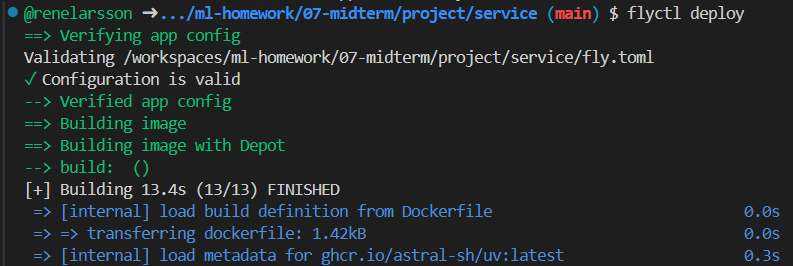
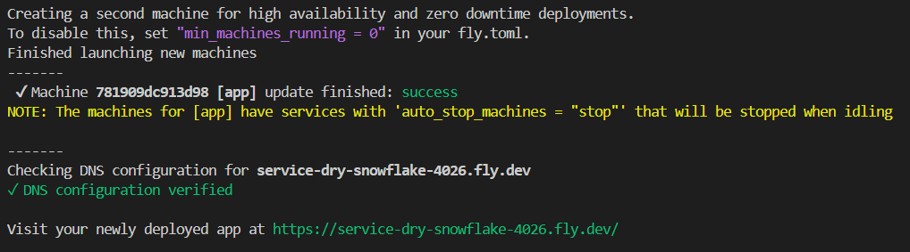
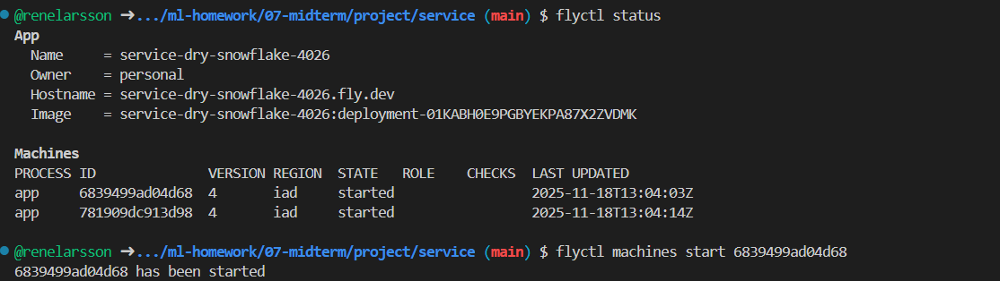
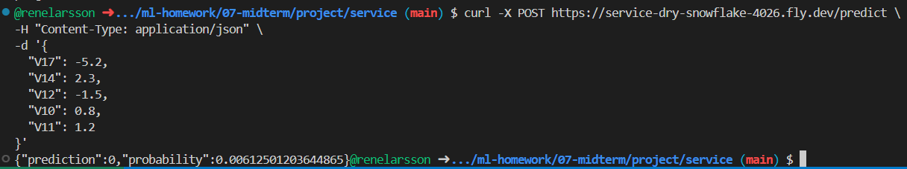

# Midterm Project: Fraud Detection in Credit Card Transactions

## Project Description
This project focuses on detecting fraudulent credit card transactions using publicly available datasets. The goal is to build a machine learning model that can accurately classify transactions as fraudulent or legitimate, helping financial institutions minimize losses due to fraud.

## Dataset
- **Source**: [Kaggle Credit Card Fraud Detection Dataset](https://www.kaggle.com/datasets/mlg-ulb/creditcardfraud)
- **Structure**:
  - Features: Numerical features representing transaction details.
  - Target: A binary variable indicating fraud (1) or legitimate (0).
- **Size**: ~285,000 transactions with 492 fraud cases (~0.17% fraud rate).
- **Format**: CSV file.

## Dataset Acquisition

To download the dataset:

1. Visit the [Kaggle dataset page](https://www.kaggle.com/datasets/mlg-ulb/creditcardfraud).
2. Download the `creditcard.csv` file.
3. Place the file in the `data/` directory.

## Repository Structure
- `data/` 
  - Raw and processed data.
- `notebooks/` 
  - Jupyter notebooks for EDA and modeling.
- `service/` 
  - FastAPI implementation for serving the model.

## Notebook
The notebook focuses on building a machine learning pipeline for fraud detection in credit card transactions. Below is a summary of its key sections:

1. **Data Preparation and Cleaning:**
   - The dataset is loaded and explored for basic information.
   - The Amount column is log-transformed to address skewness.
   - Outliers in numerical features are capped within the range [-5, 5].

2. **EDA and Feature Importance Analysis:**
   - Class imbalance is highlighted, with fraudulent transactions being heavily underrepresented.
   - Mutual information, Training Set Coefficients/Permutation Importance, and tree-based methods are used to identify important features.
   - The top features (V17, V14, V12, V10, V11) are selected for modeling.

3. **Model Selection Process and Parameter Tuning:**

   - 2 options are tested for a baseline model. Either use all features to evaluate overall performance or use a subset of the most important features (`V17`, `V14`, `V12`, `V10`, `V11`) to reduce dimensionality and improve efficiency.
   - The subset option is chosen and SMOTE is applied to address class imbalance.
   - The classification threshold is adjusted to optimize the trade-off between precision and recall. A threshold of 0.95 is chosen for the final model.
   - Higher class weights are assigned to the minority class (Class 1) to address class imbalance (1:69).
   - Ensemble and stacking techniques are explored to improve performance. 
   - The weighted Logistic Regression model remains the best-performing model due to its balance of precision and recall.

4. **Train, evaluate and save the final model on the full dataset:**
   - The final model is trained on the full dataset. 
   - Final Model Metrics: Precision 0.84, Recall 0.82, F1-Score 0.83, ROC AUC 0.96.
   - The model is saved as best_model.pkl for deployment.

5. **Run the training script of the final model:**
   ```bash
   python train.py
   ```

## Environment Management

To manage dependencies and the environment, we use `uv`. Follow these steps to initialize and manage the environment:

### Initialize the Project
1. Navigate to the `service/` folder:
   ```bash
   cd service
   ```
2. Run the following command to initialize the project:
   ```bash
   uv init
   ```

### Adding Dependencies
- To add runtime dependencies, use:
  ```bash
  uv add scikit-learn fastapi uvicorn
  ```
- To add development dependencies, use:
  ```bash
  uv add --dev requests
  ```

### Notes
- The `uv.lock` file will be generated to lock dependencies.
- Use `uv` commands to ensure consistent dependency management across environments.

## Running the Service

### Testing Locally with uvicorn
1. Activate the Virtual Environment:
   ```bash
   source .venv/bin/activate
   ```
2. Run the FastAPI application:
   ```bash
   uvicorn predict:app --host 0.0.0.0 --port 9696
   ```
3. Test the `/predict` Endpoint:

- To test the `/predict` endpoint, use the following `curl` command in a different terminal:
   ```bash
   curl -X POST http://0.0.0.0:9696/predict \
   -H "Content-Type: application/json" \
   -d '{
   "V17": -5.2,
   "V14": 2.3,
   "V12": -1.5,
   "V10": 0.8,
   "V11": 1.2
   }'
   ```

Expected response:
   ```json
      {
      "prediction": 0,
      "probability": 0.00612501203644865
      }
   ```

The service will be available at `http://localhost:9696`.

### Testing Locally with Docker
1. Build the Docker Image:
   ```bash
   docker build -t fastapi-service .
   ```
2. Run the Docker Container:
   ```bash
   docker run -p 9696:9696 fastapi-service
   ```
3. Test the `/predict` Endpoint Again.

## Deploying to Fly.io

### Prerequisites
1. Install the Fly.io CLI:
   ```bash
   curl -L https://fly.io/install.sh | sh
   ```
2. Log in to Fly.io:
   ```bash
   flyctl auth login
   ```

### Deployment Steps
1. Initialize the Fly.io app:
   ```bash
   flyctl launch
   ```
   - Choose a unique app name.
   - Select a region close to your users.
   - Do not deploy immediately.

2. Update the `fly.toml` file:
   - Ensure `internal_port` is set to `9696` under `[http_service]`.

3. Build and deploy the app:
   ```bash
   flyctl deploy
   ```

---

---

4. Verify the app is running:
   ```bash
   flyctl status
   ```

5. Check logs for errors:
   ```bash
   flyctl logs
   ```

### Testing the Deployment
1. Check Fly.io Deployment Status:
   ```bash
   flyctl status
   ```
2. Ensure the app is in the running state. If it is stopped, restart it:
   ```bash
   flyctl machines start <PROCESS ID>
   ```

---

3. Test the root endpoint:
   ```bash
   curl https://<your-app-name>.fly.dev/
   ```
4. Test the `/predict` endpoint:
   ```bash
   curl -X POST https://service-dry-snowflake-4026.fly.dev/predict \
   -H "Content-Type: application/json" \
   -d '{
   "V17": -5.2,
   "V14": 2.3,
   "V12": -1.5,
   "V10": 0.8,
   "V11": 1.2
   }'
   ```

---

## Shutting Down and Disconnecting Services

Follow these steps to properly shut down and disconnect all services, including Docker containers, images, and Fly.io deployments:

### 1. Stop Docker Containers
To stop all running Docker containers:
```bash
docker ps -q | xargs docker stop
```

### 2. Remove Docker Containers
To remove all stopped containers:
```bash
docker ps -a -q | xargs docker rm
```

### 3. Remove Docker Images
To remove all Docker images:
```bash
docker images -q | xargs docker rmi -f
```

### 4. Disconnect from Fly.io
To disconnect and shut down Fly.io services:
1. List all Fly.io apps:
   ```bash
   fly apps list
   ```
2. Stop a specific app (replace `APP_NAME` with your app name):
   ```bash
   fly apps destroy APP_NAME
   ```

### 5. Remove Fly.io Machines
If you are using Fly.io machines:
1. List all machines:
   ```bash
   fly machines list
   ```
2. Remove a specific machine (replace `MACHINE_ID` with the machine ID):
   ```bash
   fly machines remove MACHINE_ID
   ```

### 6. Clean Up Local Fly.io Configuration
To remove Fly.io configuration files (optional):
```bash
rm -rf ~/.fly
```

### 7. Verify Everything is Shut Down
- Check for running Docker containers:
  ```bash
  docker ps
  ```
- Check for Fly.io apps or machines:
  ```bash
  fly apps list
  ```

### Notes
- Ensure you have the necessary permissions to execute these commands.
- Use caution when removing Docker images or Fly.io apps, as this action is irreversible.